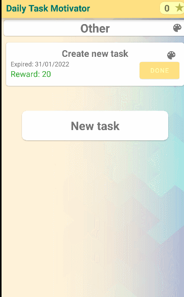
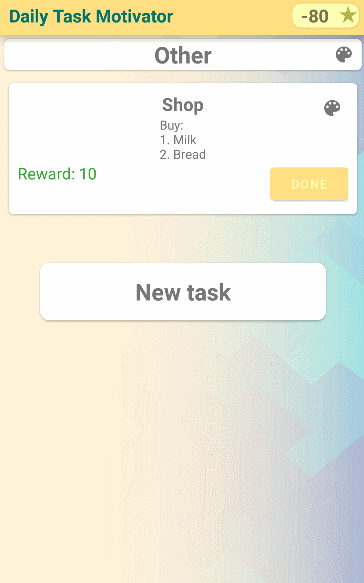

# Daily Task Motivator App
## Описание
Данное приложение позволяет создавать различные задачи для ежедневного использования.
Приложение позволяет ставить себе задачи и получать баллы за выполнение.
Вы также можете создавать задачи, которые будут тратить баллы.

### Создание задачи
Для создания задачи необходимо ввести название задачи и награду. Для удобства,
Вы можете разделять задачи по категориям.
Задачи делятся на следующие типы:
- Простая задача
- Задача с прогрессом
  - Используется, если для выполнения задачи нужно выполнить действие какое-то количество раз.
- Ежедневная задача
  - После выполнения, задача исчезает. Завтра она появится снова.
- Вечная задача
  - Можно использовать неограниченное количество раз

Вы можете установить дату, до которой необходимо выполнить задачу.
Поле "крайний срок(deadline)" позволяет задать срок выполнения задачи.
Если вы не успеете, награда за задачу уменьшиться.

 обычная | прогресс | цвет
 :-------|:--------|:----
||

### Технологии
- Git
- Custom view
- Clean architecture
- Junit tests
- Realm
- LiveData
- MVVM
- Koin
- Coroutines

### История
1. структура
2. viewBinding
3. добавлены катеории
4. добавлен ColorPicker
5. горизонтальная ориентация
6. добавлен Koin

